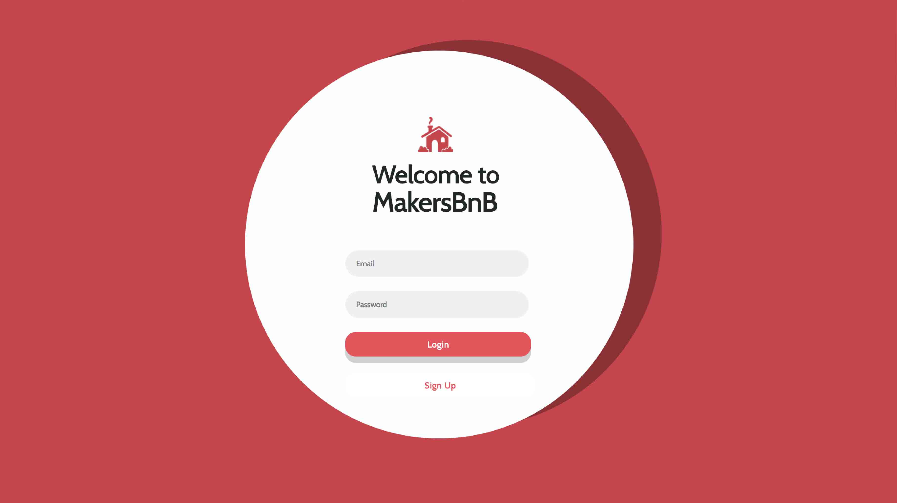
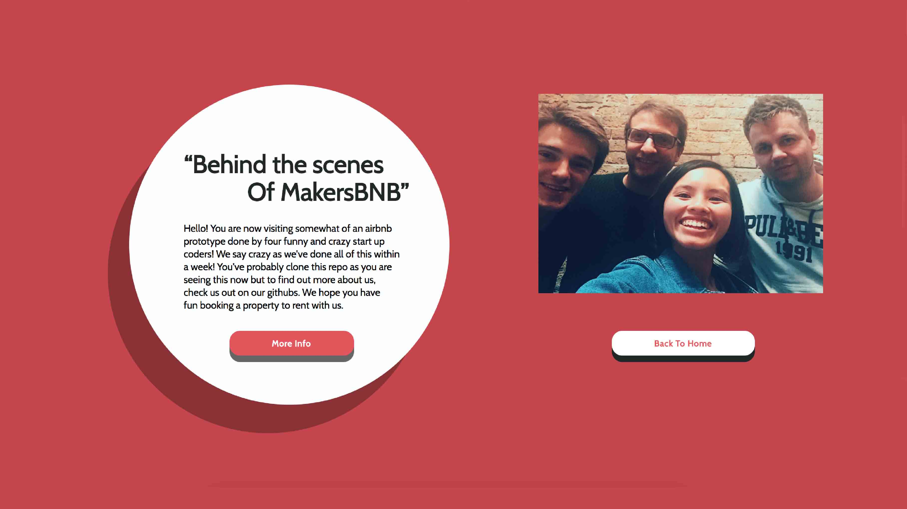

# MakersBnB

[Task](#task) | [Approach](#approach) | [Execution](#execution) | [Struggles](#struggles) | [Run the App](#demo) | [Technologies](#technologies) | [Team](#team)


## <a name="task">Task</a>

This week was our first opportunity since beginning Makers Academy to create a project as part of a group. We were tasked with implementing our own version of the popular travel site AirBnB. This brought with it a number of new challenges that we were excited to explore! It afforded us a chance to use Agile methodologies and XP values to enhance the development of our project.

I order to take an iterative approach we chose to break our project down into user stories, each of which could then be broken down into smaller components. Below are the three user stories for our MVP:

```
As a user,
So that I can consider which property to stay in,
I would like to be able to view the available rentals.

As a user,
So that I can gain more information about a rental,
I would like to be given a rental overview when I select it.

As a user,
So that I can confirm my holiday,
I want to be able to book a rental.
```
Upon completion of our MVP we joined as a team and diagrammed out the remaining user stories that we wanted to implement.

```
- User can view an image for each property
- User can sign up and sign in
- User can log in
- User can log out
- User must use unique credentials
- User can search by city
- Booking a rental results in a confirmation page being displayed
```



## <a name="approach">Approach</a>

#### Relational Databases

We wanted to use this challenge to fully cement our understanding of how relational databases operate. All the way from the commands required in postgreSQL to initially setting up a database and checking the contents of its tables, through to the use of DataMapper as an ORM and it's implementation at the model level.

#### JavaScript

Given that the previous week was our first using JavaScript and its JQuery library our team decided that we would like to use these as a method to display our rentals on the page. We therefore make a GET request to our Ruby API using JQuery and populate the page with our rentals. This also allows us to dynamically filter our properties when searching.

#### REST

The use of REST and RESTful API's is a relatively new concept to the whole team. We have therefore used this project as an exercise in understanding what it means for a website to be RESTful. We hope that we have mostly succeeded in making this a RESTful web application.

## <a name="execution">Execution</a>

We have endeavoured to follow Dont Repeat Yourself, **DRY** and Single Responsibility Principal, **SRP** at all times, extracting functions into private methods and using guard clauses where applicable. Edge cases have been accounted for through rigorous testing using doubles and method stubs in both unit and feature tests. Test classes are all run in isolation.

Feature testing of the pages is achieved through the use of Capybara, Selenium WebDriver and Phantom JS.

## <a name="struggles">Struggles</a>

* The dynamic manipulation of objects in the DOM using JavaScript and JQuery
* The implementation and use of Dates to book rentals

## <a name="demo">Run the App</a>

In order to run MakersBnB locally and execute tests it requires that the postgreSQL databases are set up on your machine. To do this follow the steps below:

* Clone this repo
* Change into the required directory and run `bundle install`.
* Now do the following (note - you may need to set up your psql beforehand):

```
➜  MakersBnB git:(master) ✗ psql
psql (9.5.9)
Type "help" for help.

lewis=> \l
                                           List of databases
             Name             |  Owner   | Encoding |   Collate   |    Ctype    |   Access privileges

------------------------------+----------+----------+-------------+-------------+-----------------------
 Default                      | postgres | UTF8     | en_GB.UTF-8 | en_GB.UTF-8 |
 blog                         | lewis    | UTF8     | en_GB.UTF-8 | en_GB.UTF-8 |
 bookmark_manager_development | lewis    | UTF8     | en_GB.UTF-8 | en_GB.UTF-8 |
 bookmark_manager_test        | lewis    | UTF8     | en_GB.UTF-8 | en_GB.UTF-8 |

lewis=> CREATE DATABASE chitter_test
CREATE DATABASE

lewis=> CREATE DATABASE chitter_development
CREATE DATABASE

lewis=> \l
                                           List of databases

             Name             |  Owner   | Encoding |   Collate   |    Ctype    |   Access privileges
------------------------------+----------+----------+-------------+-------------+-----------------------
 Default                      | postgres | UTF8     | en_GB.UTF-8 | en_GB.UTF-8 |
 blog                         | lewis    | UTF8     | en_GB.UTF-8 | en_GB.UTF-8 |
 bookmark_manager_development | lewis    | UTF8     | en_GB.UTF-8 | en_GB.UTF-8 |
 bookmark_manager_test        | lewis    | UTF8     | en_GB.UTF-8 | en_GB.UTF-8 |
 makers_bnb_development       | lewis    | UTF8     | en_GB.UTF-8 | en_GB.UTF-8 |
 makers_bnb_test              | lewis    | UTF8     | en_GB.UTF-8 | en_GB.UTF-8 |

```

 You can then run `rackup` to start the local server and Following this navigate to your browser of choice and enter your the port on which you are hosting (we have defaulted it to use 9292). If this doesn't work you may need to run `rake db:auto_migrate` in the terminal to generate your User and Post tables.

# <a name="technologies">Technologies</a>

Development was entirely test driven using Ruby 2.4.1, JavaScript(JQuery) and RSpec testing framework. Capybara, Poltergeist and Selenium-WebDriver were used to automate browser feature tests. Rubocop was used to ensure standardised code formatting. The Sinatra web framework along with ERB was used to develop the web application. Databases are generated and managed using postgreSQL and maintained via Ruby using the ORM DataMapper. Password encryption is achieved through the use of the BCrypt gem.


# <a name="team">Team</a>



- Dania Mah (https://github.com/thatdania)
- Lewis Youl (https://github.com/LewisYoul)
- Oleg Grushetskyy (https://github.com/olegfkl)
- Robert Clayton (https://github.com/RobertClayton)
